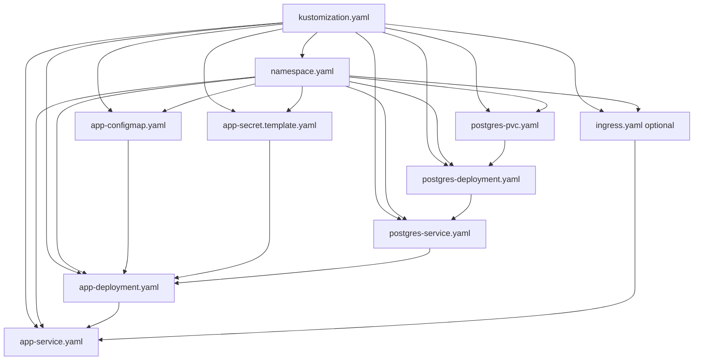

# Local Kubernetes Setup (Minikube Only)

This guide is only for local deployment on your laptop using Minikube.

## 1) Prerequisites (Local)

1. Docker Desktop installed and running.
2. kubectl installed.
3. Minikube installed.
4. Project cloned and you can access the `k8s` folder.

Verify tools:

```bash
docker --version
kubectl version --client
minikube version
```

## 2) Required Kubernetes Manifests (Local)

Your local deployment needs these files inside `k8s/`:

1. `namespace.yaml`
2. `app-configmap.yaml`
3. `app-secret.template.yaml`
4. `postgres-pvc.yaml`
5. `postgres-deployment.yaml`
6. `postgres-service.yaml`
7. `app-deployment.yaml`
8. `app-service.yaml`
9. `kustomization.yaml`

Optional for local:

1. `ingress.yaml` (only if you want ingress-based access locally)

## 2A) YAML-by-YAML: What to Keep and Why (Local)

### `namespace.yaml`

Keep these details:
1. `apiVersion: v1`
2. `kind: Namespace`
3. `metadata.name: bug-report-portal`

Use:
1. Logical isolation of all app resources in one namespace.

### `app-configmap.yaml`

Keep these details:
1. `kind: ConfigMap`
2. `metadata.name: bug-report-portal-config`
3. `metadata.namespace: bug-report-portal`
4. `data.PORT`
5. `data.PORTAL_LOGIN_USERNAME`
6. `data.PRISMA_CLIENT_ENGINE_TYPE`

Use:
1. Stores non-secret runtime app settings.

### `app-secret.template.yaml`

Keep these details:
1. `kind: Secret`
2. `metadata.name: bug-report-portal-secrets`
3. `metadata.namespace: bug-report-portal`
4. `type: Opaque`
5. `stringData.POSTGRES_USER`
6. `stringData.POSTGRES_PASSWORD`
7. `stringData.PORTAL_LOGIN_PASSWORD`
8. `stringData.AUTH_COOKIE_SECRET`
9. `stringData.DATABASE_URL`

Use:
1. Stores sensitive credentials and connection values.

### `postgres-pvc.yaml`

Keep these details:
1. `kind: PersistentVolumeClaim`
2. `metadata.name: postgres-pvc`
3. `spec.accessModes: ReadWriteOnce`
4. `spec.resources.requests.storage` (example `2Gi`)

Use:
1. Persists Postgres data across pod restarts.

### `postgres-deployment.yaml`

Keep these details:
1. `kind: Deployment`
2. `metadata.name: postgres`
3. `spec.selector.matchLabels.app: postgres`
4. Pod template label `app: postgres`
5. Container image `postgres:16-alpine`
6. Env keys for `POSTGRES_DB`, `POSTGRES_USER`, `POSTGRES_PASSWORD`
7. Volume mount `/var/lib/postgresql/data`
8. Readiness and liveness probes using `pg_isready`
9. PVC claim reference `postgres-pvc`

Use:
1. Runs database container with health checks and persistent storage.

### `postgres-service.yaml`

Keep these details:
1. `kind: Service`
2. `metadata.name: postgres`
3. Selector `app: postgres`
4. Port `5432`

Use:
1. Gives stable DNS name `postgres` used by `DATABASE_URL`.

### `app-deployment.yaml`

Keep these details:
1. `kind: Deployment`
2. `metadata.name: bug-report-portal-app`
3. `spec.selector.matchLabels.app: bug-report-portal-app`
4. Pod template label `app: bug-report-portal-app`
5. Container image `bug-report-portal:local`
6. `envFrom` ConfigMap `bug-report-portal-config`
7. `envFrom` Secret `bug-report-portal-secrets`
8. DB wait init container before app startup
9. Readiness and liveness probes on `/login`
10. Uploads volume mount `/app/uploads`

Use:
1. Runs application pod and ensures startup order after DB readiness.

### `app-service.yaml`

Keep these details:
1. `kind: Service`
2. `metadata.name: bug-report-portal-service`
3. Selector `app: bug-report-portal-app`
4. Service port `3000`

Use:
1. Stable in-cluster endpoint for the app.

### `ingress.yaml` (optional local)

Keep these details:
1. `kind: Ingress`
2. `spec.ingressClassName` (example `nginx`)
3. Rule host (example `bug-report.local`)
4. Backend service `bug-report-portal-service:3000`

Use:
1. Host-based access when ingress controller is enabled.

### `kustomization.yaml`

Keep these details:
1. `apiVersion: kustomize.config.k8s.io/v1beta1`
2. `kind: Kustomization`
3. `resources` list with all required manifest files

Use:
1. Single entry point for `kubectl apply -k k8s`.

## 2B) How All YAMLs Are Interlinked (Local)

Resource dependency chain:
1. `kustomization.yaml` includes all manifest files and applies them as one unit.
2. `namespace.yaml` creates `bug-report-portal`; all other resources live in this namespace.
3. `app-configmap.yaml` and `app-secret.template.yaml` are consumed by `app-deployment.yaml` using `envFrom`.
4. `postgres-pvc.yaml` is mounted by `postgres-deployment.yaml` to persist DB data.
5. `postgres-deployment.yaml` is exposed by `postgres-service.yaml`.
6. `app-secret.template.yaml` contains `DATABASE_URL` host `postgres`, which resolves through `postgres-service.yaml`.
7. `app-deployment.yaml` waits for DB readiness, then starts app container.
8. `app-deployment.yaml` pods are exposed by `app-service.yaml`.
9. Optional `ingress.yaml` routes external traffic to `app-service.yaml`.

Startup/runtime flow:
1. Ingress (optional) -> app service -> app pod.
2. App pod -> postgres service -> postgres pod.
3. Postgres pod -> postgres PVC (persistent data).



## 3) One-Time Wiring Checks

1. In `app-secret.template.yaml`, `DATABASE_URL` host must be `postgres`.
2. App deployment labels must match app service selector.
3. Postgres deployment labels must match postgres service selector.
4. Postgres PVC name must match the claim name in postgres deployment.
5. All namespaced resources should use namespace `bug-report-portal`.

## 4) End-to-End Local Deployment Steps

1. Go to project root:

```bash
cd /Users/demu/projects/bug-report-portal
```

2. Optional clean start:

```bash
kubectl delete -k k8s --ignore-not-found=true
```

Why `--ignore-not-found=true`:
1. If resources are already deleted, command still succeeds.
2. This makes cleanup idempotent (safe to run repeatedly).

3. Start Minikube:

```bash
minikube start
```

4. Verify cluster health:

```bash
minikube status
kubectl config current-context
kubectl get nodes -o wide
```

Expected:
1. Context is `minikube`.
2. Node is `Ready`.

5. Point Docker to Minikube daemon:

```bash
eval "$(minikube docker-env)"
```

6. Build image used by app deployment:

```bash
docker build -t bug-report-portal:local .
```

7. Validate manifests before apply:

```bash
kubectl kustomize k8s >/tmp/k8s_render.yaml
kubectl apply -k k8s --dry-run=client
```

8. Deploy all resources:

```bash
kubectl apply -k k8s
```

9. Wait for database rollout:

```bash
kubectl rollout status deployment/postgres -n bug-report-portal --timeout=240s
```

10. Wait for app rollout:

```bash
kubectl rollout status deployment/bug-report-portal-app -n bug-report-portal --timeout=240s
```

11. Check runtime state:

```bash
kubectl get pods -n bug-report-portal
kubectl get svc -n bug-report-portal
```

12. Access app locally:

```bash
kubectl port-forward -n bug-report-portal service/bug-report-portal-service 18080:3000
```

Open:
1. http://127.0.0.1:18080/login

13. Optional HTTP check from another terminal:

```bash
curl -i http://127.0.0.1:18080/login
```

Expected:
1. HTTP 200.

## 4A) Local Access Notes

1. `http://127.0.0.1:18080/login` and `http://localhost:18080/login` are equivalent for local testing.
2. Use whichever is convenient; both resolve to your machine.
3. Port-forward must remain running while you access the app from browser or curl.
4. If you stop port-forward, the local URL stops working until you run it again.

## 5) Local Update Cycle (After Code Changes)

```bash
eval "$(minikube docker-env)"
docker build -t bug-report-portal:local .
kubectl apply -k k8s
kubectl rollout status deployment/bug-report-portal-app -n bug-report-portal --timeout=240s
```

## 5A) Verify Kubernetes Is Using Your Built Image

After build and deploy, run these checks:

1. Confirm deployment image tag:

```bash
kubectl get deployment bug-report-portal-app -n bug-report-portal -o jsonpath='{.spec.template.spec.containers[0].image}'
```

Expected:
1. `bug-report-portal:local`

2. Confirm running pod image and image ID:

```bash
kubectl get pods -n bug-report-portal
kubectl get pod -n bug-report-portal -l app=bug-report-portal-app -o jsonpath='{.items[0].spec.containers[0].image}{"\n"}{.items[0].status.containerStatuses[0].imageID}{"\n"}'
```

Expected:
1. Image is `bug-report-portal:local`
2. Image ID is present (`sha256:...`)

3. If you rebuilt but pods still use old image, force a restart:

```bash
kubectl rollout restart deployment/bug-report-portal-app -n bug-report-portal
kubectl rollout status deployment/bug-report-portal-app -n bug-report-portal --timeout=240s
```

4. Verify image exists in Minikube Docker daemon:

```bash
eval "$(minikube docker-env)"
docker images | grep bug-report-portal
```

Note:
1. This project uses `imagePullPolicy: IfNotPresent` in app deployment, so Kubernetes uses the local image if available in Minikube.

## 6) Local Troubleshooting

```bash
kubectl get events -n bug-report-portal --sort-by=.lastTimestamp | tail -n 40
kubectl logs -n bug-report-portal deployment/postgres --tail=200
kubectl logs -n bug-report-portal deployment/bug-report-portal-app --tail=200
kubectl get pods -n bug-report-portal
kubectl describe pod -n bug-report-portal <pod-name>
```

## 6A) Troubleshooting Matrix (Symptom -> YAML Link)

1. Symptom: app pod is `CrashLoopBackOff` with DB connection errors (`P1001`).
Likely YAML links: `app-secret.template.yaml` (`DATABASE_URL`), `postgres-service.yaml` (service name/port), `app-deployment.yaml` (DB wait init container).
What to verify: `DATABASE_URL` host is `postgres`; postgres service name is exactly `postgres` on port `5432`; app deployment still includes DB wait init container.

2. Symptom: app pod running but service has no endpoints.
Likely YAML links: `app-deployment.yaml` labels, `app-service.yaml` selector.
What to verify: app pod label and app service selector are both `app: bug-report-portal-app`.

3. Symptom: postgres pod pending due to storage.
Likely YAML links: `postgres-pvc.yaml`, `postgres-deployment.yaml` volume claim reference.
What to verify: PVC name matches claim reference (`postgres-pvc`); requested storage is supported by local provisioner.

4. Symptom: login endpoint fails readiness/liveness checks.
Likely YAML links: `app-deployment.yaml` probes, `app-configmap.yaml` (`PORT`).
What to verify: probes use path `/login` and port `3000`; app `PORT` value aligns with container port and service targetPort.

5. Symptom: cannot access app through ingress host.
Likely YAML links: `ingress.yaml`, `app-service.yaml`.
What to verify: ingress backend points to `bug-report-portal-service:3000`; ingress controller is installed locally.

6. Symptom: manifests apply but resources appear in wrong namespace.
Likely YAML links: `namespace.yaml`, namespaced manifest metadata, `kustomization.yaml` resources list.
What to verify: every manifest uses `namespace: bug-report-portal` where applicable; `namespace.yaml` is included in `kustomization.yaml`.

## 7) Local Cleanup Options

Remove only app resources:

```bash
kubectl delete -k k8s --ignore-not-found=true
```

Stop cluster (keep state):

```bash
minikube stop
```

Delete cluster completely:

```bash
minikube delete
```
