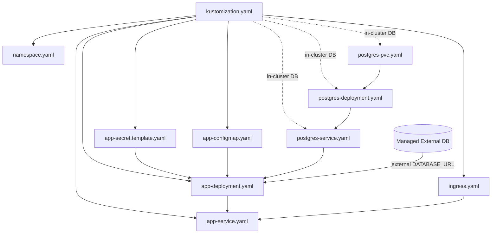

# Production Kubernetes Setup (Cluster Only)

This guide is only for production-like deployment on a real Kubernetes cluster.

## 1) Prerequisites (Production)

1. A running Kubernetes cluster (EKS, AKS, GKE, or on-prem).
2. kubectl installed and configured to the target cluster.
3. Access to a container registry.
4. DNS and TLS plan for ingress host.
5. Secret values prepared (do not use local defaults).

Verify cluster access:

```bash
kubectl config current-context
kubectl get nodes
```

## 2) Required Kubernetes Manifests (Production)

Required files in `k8s/`:

1. `namespace.yaml`
2. `app-configmap.yaml`
3. `app-secret.template.yaml` (replace placeholder values)
4. `postgres-pvc.yaml` (or external DB strategy)
5. `postgres-deployment.yaml` (skip if using managed external DB)
6. `postgres-service.yaml` (skip if using managed external DB)
7. `app-deployment.yaml`
8. `app-service.yaml`
9. `kustomization.yaml`

Optional but typical in production:

1. `ingress.yaml` (for external access)

## 2A) YAML-by-YAML: What to Keep and Why (Production)

### `namespace.yaml`

Keep these details:
1. Namespace name for the app (example `bug-report-portal`).

Use:
1. Isolates production resources and policies.

### `app-configmap.yaml`

Keep these details:
1. Non-secret app settings (`PORT`, app username if applicable, Prisma engine type).
2. Namespace matching production namespace.

Use:
1. Central place for non-sensitive runtime configuration.

### `app-secret.template.yaml`

Keep these details:
1. Strong values for `POSTGRES_PASSWORD`, `PORTAL_LOGIN_PASSWORD`, `AUTH_COOKIE_SECRET`.
2. Correct `DATABASE_URL` for production DB endpoint.
3. Namespace and secret name matching app deployment references.

Use:
1. Secure storage for credentials and connection strings.

### `postgres-pvc.yaml` (if in-cluster DB)

Keep these details:
1. Adequate storage size for production workload.
2. Proper storage class policy for your cluster.

Use:
1. Durable database storage.

### `postgres-deployment.yaml` (if in-cluster DB)

Keep these details:
1. Container image version pinning.
2. Env values from Secret.
3. Readiness/liveness probes.
4. PVC mount to `/var/lib/postgresql/data`.

Use:
1. In-cluster Postgres workload.

### `postgres-service.yaml` (if in-cluster DB)

Keep these details:
1. Service name used in DB host resolution.
2. Port 5432 mapping.
3. Selector matching postgres deployment labels.

Use:
1. Stable service endpoint for app-to-DB communication.

### `app-deployment.yaml`

Keep these details:
1. Image set to pushed registry tag (not local tag).
2. `envFrom` references to ConfigMap and Secret.
3. Readiness/liveness probes for HTTP `/login`.
4. Init container DB wait logic if app depends on startup DB readiness.
5. Optional resource requests/limits for predictable scheduling.

Use:
1. Main production application workload.

### `app-service.yaml`

Keep these details:
1. Selector matching app deployment labels.
2. Service port and targetPort as expected by ingress.

Use:
1. Internal app endpoint for ingress and in-cluster traffic.

### `ingress.yaml` (recommended production)

Keep these details:
1. `ingressClassName` for your controller.
2. Hostname and path routing.
3. Backend service name/port mapping.
4. TLS configuration when using HTTPS.

Use:
1. External HTTP/HTTPS entry point.

### `kustomization.yaml`

Keep these details:
1. Correct `resources` list for chosen DB model:
2. Keep postgres manifests if using in-cluster DB.
3. Remove postgres manifests if using managed external DB.

Use:
1. Single controlled deploy unit for production via `kubectl apply -k k8s`.

## 2B) How All YAMLs Are Interlinked (Production)

Standard in-cluster DB flow:
1. `kustomization.yaml` orchestrates all resources in one apply unit.
2. `namespace.yaml` scopes all resources.
3. `app-configmap.yaml` and `app-secret.template.yaml` inject runtime config into app deployment.
4. `postgres-pvc.yaml` provides durable storage for postgres deployment.
5. `postgres-service.yaml` provides DB DNS endpoint used by `DATABASE_URL` in app secret.
6. `app-service.yaml` exposes app pods selected by labels from app deployment.
7. `ingress.yaml` routes public traffic to app service.

Managed external DB variant:
1. Remove `postgres-pvc.yaml`, `postgres-deployment.yaml`, and `postgres-service.yaml` from `kustomization.yaml`.
2. Set external DB host in `DATABASE_URL` inside `app-secret.template.yaml`.
3. Keep app deployment, app service, and ingress unchanged.



## 3) Production Image Build and Push

1. Build tagged image:

```bash
docker build -t your-registry/bug-report-portal:v1 .
```

2. Push image:

```bash
docker push your-registry/bug-report-portal:v1
```

3. Update app image in `k8s/app-deployment.yaml`:

```yaml
image: your-registry/bug-report-portal:v1
```

## 4) Production Secret and Config Preparation

1. Replace all placeholder values in `k8s/app-secret.template.yaml`.
2. Use strong `AUTH_COOKIE_SECRET` and passwords.
3. Ensure `DATABASE_URL` matches your production DB endpoint.
4. If using external DB, point `DATABASE_URL` to that host and remove in-cluster postgres resources from `kustomization.yaml`.

## 5) End-to-End Production Deployment Steps

1. Go to project root:

```bash
cd /Users/demu/projects/bug-report-portal
```

2. Validate manifests:

```bash
kubectl kustomize k8s >/tmp/k8s_render_prod.yaml
kubectl apply -k k8s --dry-run=client
```

3. Apply resources:

```bash
kubectl apply -k k8s
```

4. Wait for DB rollout (only if in-cluster postgres is used):

```bash
kubectl rollout status deployment/postgres -n bug-report-portal --timeout=300s
```

5. Wait for app rollout:

```bash
kubectl rollout status deployment/bug-report-portal-app -n bug-report-portal --timeout=300s
```

6. Verify runtime:

```bash
kubectl get pods -n bug-report-portal
kubectl get svc -n bug-report-portal
kubectl get ingress -n bug-report-portal
```

7. Verify endpoint:

```bash
curl -I http://your-host/login
```

## 5A) Production Access Notes

1. Production user traffic should come through ingress or load balancer URL, not port-forward.
2. `kubectl port-forward` in production is optional and intended for temporary admin/debug checks.
3. End users should never depend on a developer terminal session for access.
4. Keep TLS/HTTPS on public production endpoints.

## 6) Production Update Cycle (New Release)

1. Build and push new image tag.
2. Update `k8s/app-deployment.yaml` image tag.
3. Apply manifests:

```bash
kubectl apply -k k8s
```

4. Check rollout:

```bash
kubectl rollout status deployment/bug-report-portal-app -n bug-report-portal --timeout=300s
```

## 7) Production Rollback

```bash
kubectl rollout undo deployment/bug-report-portal-app -n bug-report-portal
```

## 8) Production Troubleshooting

```bash
kubectl get events -n bug-report-portal --sort-by=.lastTimestamp | tail -n 50
kubectl logs -n bug-report-portal deployment/bug-report-portal-app --tail=200
kubectl logs -n bug-report-portal deployment/postgres --tail=200
kubectl describe pod -n bug-report-portal <pod-name>
```

## 8A) Troubleshooting Matrix (Symptom -> YAML Link)

1. Symptom: app deploys but cannot connect to DB.
Likely YAML links: `app-secret.template.yaml` (`DATABASE_URL`), `postgres-service.yaml` (if in-cluster DB), `kustomization.yaml` (DB resources included or intentionally removed).
What to verify: in-cluster DB uses host `postgres` and postgres service exists; external DB setup removes postgres manifests and points URL to managed DB host.

2. Symptom: new release rolled out but old image is still running.
Likely YAML links: `app-deployment.yaml` image tag.
What to verify: deployment image uses the new pushed tag; tag exists in registry.

3. Symptom: ingress returns 404 or 502.
Likely YAML links: `ingress.yaml` host/path/backend, `app-service.yaml` service name/port, `app-deployment.yaml` readiness state.
What to verify: ingress backend targets `bug-report-portal-service:3000`; service selector matches app deployment labels; app pods are Ready.

4. Symptom: DB data not retained after restart (in-cluster DB).
Likely YAML links: `postgres-pvc.yaml`, `postgres-deployment.yaml` PVC mount/claim.
What to verify: PVC is Bound; deployment mounts PVC at `/var/lib/postgresql/data`.

5. Symptom: app pods running but service has zero endpoints.
Likely YAML links: `app-service.yaml` selector, `app-deployment.yaml` pod labels.
What to verify: labels and selectors match exactly.

6. Symptom: secret/config changes applied but app behavior unchanged.
Likely YAML links: `app-configmap.yaml`, `app-secret.template.yaml`, `app-deployment.yaml`.
What to verify: ConfigMap and Secret updates were applied in correct namespace; restart app deployment after critical env changes.
